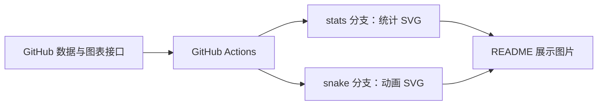

# 个人主页制作与维护

这个仓库用 `README.md` 展示个人介绍、项目、技术栈和 GitHub 统计。页面由 GitHub 渲染，无需单独部署网站；统计图和贪吃蛇动画由 GitHub Actions 定时生成，再作为 SVG 图片嵌入主页。

## 页面如何组成

[README.md](README.md) 混合使用 Markdown 和 HTML：

- Markdown 编写简介、项目说明和链接。
- `<div align="center">` 居中展示头像和统计图。
- `<table>` 排列技术栈图标，图标文件位于 `assets/`。
- `<details>` 和 `<summary>` 折叠统计与贪吃蛇区域。
- `` 控制图片尺寸；GitHub Stats 和 Most Used Languages 都设置 `height="165"`，宽度按原比例计算。两张图片相邻排列，空间不足时可能换行。
- `<picture>` 根据浅色、深色偏好选择 Trophy Board 和贪吃蛇的图片。

头像来自 `img.startyi.com`，链接徽章来自 Shields.io；统计图则读取本仓库生成分支中的文件。

## 为什么把图片保存在分支中

如果 README 直接引用动态统计接口，打开主页时就依赖该接口及时返回图片。这里将取数、渲染安排在 Actions 中，访客读取的是上次成功生成的 SVG。



| 分支 | 用途 |
| --- | --- |
| `main` | README、静态图标、生成脚本、测试与工作流配置 |
| `stats` | 两张基础统计图、连续贡献图、活动图、浅色与深色奖杯图 |
| `snake` | 浅色与深色贪吃蛇动画 |

README 使用 `https://raw.githubusercontent.com/StarHeartY/StarHeartY/分支名/文件名` 引用图片。生成图片不需要合并回 `main`，也无需启用 GitHub Pages；工作流中的发布 Action 用来将文件推送到指定分支。

## 各张图如何生成

| 图表 | 生成方式 | 产物 |
| --- | --- | --- |
| Most Used Languages | 下载现有 Vercel 统计接口返回的 SVG | `stats/languages.svg` |
| GitHub Stats | 下载现有 Vercel 统计接口返回的 SVG | `stats/github-stats.svg` |
| Current Streak | `DenverCoder1/github-readme-streak-stats` 在 Actions 内生成 | `stats/streak.svg` |
| 活动图 | 下载现有 Vercel 活动图接口返回的 SVG | `stats/activity.svg` |
| Trophy Board | Python 查询 GitHub GraphQL API 并绘制 SVG | `stats/trophy.svg`、`stats/trophy-dark.svg` |
| 贪吃蛇 | `Platane/snk` 根据贡献数据生成 SVG 动画 | `snake/github-contribution-grid-snake.svg`、对应的 `-dark.svg` |

这里的 `stats/` 和 `snake/` 表示分支，后面是各自分支根目录中的文件名。

### 更新频率和失败处理

[stats.yml](.github/workflows/stats.yml) 每 6 小时运行一次，计划时间为 UTC+8 的 **02:17、08:17、14:17、20:17**。修改 README 或该工作流列出的脚本并推送到 `main`，也会触发更新。

工作流依次运行奖杯测试、生成两种奖杯图、生成连续贡献图、下载并校验另外三张图，最后将 `dist/` 发布到 `stats`。其中任何一步失败都不会发布这批图片，远端上一批成功产物会保留。首次成功运行之前，新图片链接尚不可用。

[profile_stats.py](scripts/profile_stats.py) 会解析 SVG 并检查预期统计标签，避免把 HTTP 200 返回的错误提示卡当作正常图片保存。下载失败会重试，最多尝试 4 次。Vercel 接口仍影响后台更新，但不再位于访客打开主页时的生成链路中。

[snake.yml](.github/workflows/snake.yml) 每天 UTC+8 **08:00** 计划运行，推送到 `main` 时也会运行。两个工作流均支持在 GitHub 的 **Actions → 对应工作流 → Run workflow** 手动触发。计划时间不代表图片一定在该分钟更新完成。

### Trophy Board 的统计口径

[trophy.py](scripts/trophy.py) 遍历当前账号拥有的全部公开、非 Fork 仓库，按分页汇总数据：

| 奖章 | 含义 |
| --- | --- |
| Stars | 上述仓库获得的 Star 总数 |
| Repositories | 上述仓库数量 |
| Followers | 账号的关注者数量 |
| Forks | 上述仓库被 Fork 的总次数 |
| Contributions | GitHub 贡献日历接口返回的过去一年贡献总数，不等同于全部历史提交数 |
| Years on GitHub | 按账号创建日期计算的完整年份 |

奖章是统计数据的视觉展示，没有额外的等级或解锁规则。不同图表的统计范围可能不同，因此它们的数值不一定一一对应。

## 如何修改样式

| 想修改的内容 | 修改位置 |
| --- | --- |
| 文案、图表顺序、显示尺寸、折叠区域 | [README.md](README.md) |
| Stats 和语言图的主题、边框、接口地址 | [profile_stats.py](scripts/profile_stats.py) 中的 `CARDS` |
| 连续贡献图的圆环、火焰、数字、边框颜色 | [stats.yml](.github/workflows/stats.yml) 的 `options` |
| 奖章顺序、标题、图标、浅色与深色强调色 | [trophy.py](scripts/trophy.py) 中的 `ITEMS` |
| 奖杯图的尺寸、间距、文字样式 | 同一脚本的 `render_svg()` |
| 贪吃蛇的深色配色 | [snake.yml](.github/workflows/snake.yml) 的 `outputs` |

Stats 和语言图目前使用 `theme=transparent&hide_border=true`。这些设置属于 SVG 生成参数，不能通过调整 README 中 `` 的边框来替代。

奖杯图采用透明背景、六色奖章和统一文字颜色，分别生成浅色与深色版本。修改生成样式后，需要等待工作流重新发布图片，README 才能显示新效果。

新增统计图时，应将其生成步骤放在现有 `stats` 工作流的发布步骤之前，让 `dist/` 包含需要发布的完整图片集合，避免多个工作流各自发布不完整的同一分支。

## 本地验证与排查

在仓库根目录运行以下命令，检查取数汇总、分页、年份计算、SVG 生成、下载重试和失败保护逻辑。这些测试使用模拟数据，不需要网络或令牌：

```sh
python -B -m unittest scripts.test_trophy scripts.test_profile_stats
git diff --check
```

当前 Actions 自动运行 `test_trophy.py`；`test_profile_stats.py` 可用上面的命令手动运行。测试通过不等于线上接口可用，实际运行情况仍以 Actions 日志和发布的 SVG 为准。

工作流使用自动提供的 `GITHUB_TOKEN` 查询数据，并通过 `contents: write` 权限发布图片，不需要在源码中填写个人令牌。[.gitignore](.gitignore) 忽略 Python 缓存、虚拟环境、IDE 配置和本地 `dist/` 产物；正式图片由发布步骤写入对应分支。

图片异常时按以下顺序检查：

1. 在 Actions 查看对应工作流是否成功，定位失败的生成或下载步骤。
2. 查看 `stats` 或 `snake` 分支中是否存在目标 SVG，以及最近一次更新时间。
3. 核对 README 的分支名、文件名和浅深色图片链接。
4. 如果产物已更新但主页仍显示旧图，再检查浏览器或图片缓存。

不要只在生成分支手动修图：下一次 Actions 发布会覆盖它。长期修改应落在 `main` 中的生成脚本或工作流参数上。

[⇦ 返回 README](README.md)
